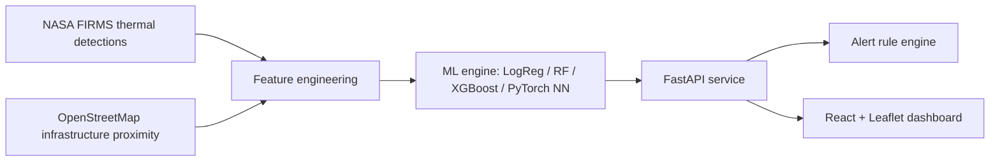
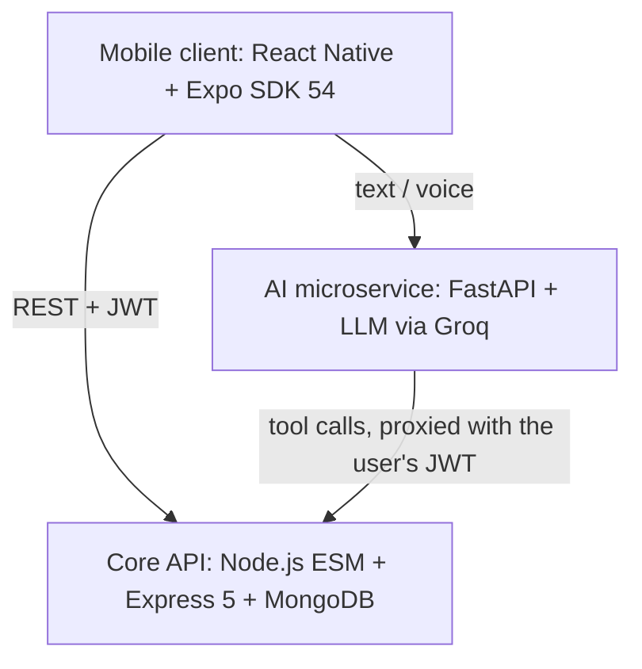
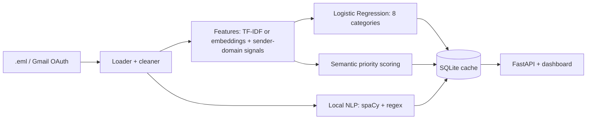

<div align="center">

# `> hello, world_`

[](https://github.com/devankk667)


</div>

---

## 🖥️ `whoami`

```text
devankk667@github
-----------------
role      : Student & Researcher
focus     : Applied ML · Geospatial ML · LLM-powered apps · Full-stack
languages : Python, JavaScript
serving   : FastAPI · Express 5
learning  : tool-calling agents, RAG, leakage-safe model evaluation
status    : open to internships → ML Engineer | Data Scientist | Data Analyst
```

```python
class Devankk667:
    mantra = "Transform data into actionable insights."

    def build(self, problem):
        data     = self.clean(problem)                  # garbage in, garbage out
        features = self.engineer(data)                  # domain knowledge > bigger model
        model    = self.validate_without_leakage(features)  # the part people skip
        return self.ship(model)                         # API + UI + Docker, not just a notebook
```

---

## 🧰 Tech Stack (by layer)

| Layer | Tools |
|---|---|
| **Languages** |   |
| **Data & Classical ML** |     |
| **Deep Learning & NLP** |   `sentence-transformers` `Whisper` |
| **Backend** |      |
| **Frontend** |    `Leaflet` `Recharts` |
| **Storage** |   |
| **DevOps** |  `docker-compose` `pytest` |

---

## 🌟 Featured Projects

### 🔥 [namyadam](https://github.com/devankk667/namyadam): AI Industrial Thermal Anomaly & Fire Monitoring

> **Problem:** satellites see heat, not intent. A refinery flare stack, a wildfire, and a crop burn all look like "a hot pixel". This system uses thermal physics plus spatial context to tell them apart.

**How it works**



**Engineering highlights**

- **Physics-informed features:** uses brightness-temperature difference `T_diff = T4 − T31` and fire radiative power (FRP) as signals, rather than only raw pixels.
- **Spatial context:** OSM proximity features separate "persistent industrial source" from "transient wildfire".
- **Leakage-safe validation:** a random split lets nearby hotspots from the *same* industrial cluster land in both train and test, which inflates scores. Spatial `GroupKFold` keeps whole clusters together so the metrics are honest.
- **Model bake-off:** Logistic Regression → Random Forest → XGBoost → PyTorch NN, compared on the same grouped splits.
- **Early-warning engine:** rule-based alerts for high-FRP outbursts, industrial fires, and persistent flare anomalies.
- **Interactive prediction studio:** feed custom feature vectors to trained checkpoints and see feature importances.
- **Offline demo mode:** `DEMO_MODE=true` runs on a bundled dataset centred on real industrial hubs (Permian Basin, Ruhr Valley, Houston Ship Channel, Jurong Island), so it works with no API keys.

<details>
<summary><b>📡 API surface (click to expand)</b></summary>

| Endpoint | Method | Purpose |
|---|---|---|
| `/api/detections` | GET | Paginated detections, filter by confidence / FRP / region |
| `/api/detections/{id}` | GET | Event detail with spatial context and live inference |
| `/api/predictions` | POST | Classify a custom input vector |
| `/api/analytics/{summary,temporal,classification,regions,persistence}` | GET | Metrics, trends, regional density, recurring flare stacks |
| `/api/alerts` | GET | Alerts from the risk engine |
| `/api/models` | GET | Benchmarks, feature importances, version metadata |

</details>

```bash
docker-compose up --build        # API :8000 (Swagger at /docs) · dashboard :5173
```

`Python 3.12` `FastAPI` `PyTorch` `XGBoost` `scikit-learn` `React 18` `Vite` `Leaflet` `Recharts` `Docker` `pytest`

---

### 🎓 [DevOops](https://github.com/devankk667/DevOops): AetherOS, an AI-powered campus platform

*Contributor* · forked from [divykasodariya/DevOops](https://github.com/divykasodariya/DevOops)

> **Problem:** campus workflows (attendance, leave approvals, bookings) are scattered across forms and WhatsApp groups. AetherOS puts them in one role-aware mobile app with an AI copilot on top.

**Three-tier architecture**



**Engineering highlights**

- **Permission-safe AI agent:** the copilot never gets a privileged key. The AI service forwards the *user's own JWT* back to the Node API when executing tool calls, so the LLM can only do what that user could already do.
- **Role-based access control:** separate permissions for Students, Faculty, HODs, Principals, and Admins.
- **Idempotent attendance:** course-linked, so duplicate submissions can't double-count.
- **Multi-tier approval routing:** leave requests, recommendation letters, and facility bookings flow through configurable approval chains.
- **Voice interface:** on-device recording with Whisper transcription feeds the same assistant pipeline.

`React 19` `React Native` `Expo Router` `Node.js` `Express 5` `MongoDB` `Mongoose 9` `JWT` `FastAPI` `Groq` `Whisper`

---

### 📬 [email_curator](https://github.com/devankk667/email_curator): Mail Curator.ai

> **Problem:** inboxes are unstructured text with hidden deadlines. This app classifies, ranks, searches, and summarizes mail, mostly with local models.

**Processing pipeline**



**Engineering highlights**

- **Hybrid training data:** synthetic emails + SpamAssassin corpus + real Gmail messages, retrainable from the UI via a background job.
- **Richer than bag-of-words:** `sentence-transformers` embeddings combined with engineered features and sender-domain signals.
- **Local intelligence engine:** extractive summaries, action items, deadlines, and entities (orgs, locations, money, reference numbers) via spaCy plus context rules.
- **RAG-style chat:** retrieves relevant emails by semantic similarity, then answers with an optional Groq LLM or a local fallback.
- **SQLite metadata cache:** avoids recomputing expensive NLP on every request.
- **Deployment-ready:** Docker, docker-compose, and Vercel/Render config.

<details>
<summary><b>🧪 Engineering notes: what I'd improve next (click to expand)</b></summary>

- The training set is mostly synthetic, so I'd build a small manually labelled real-inbox validation set for a trustworthy accuracy number.
- Search and chat recompute embeddings per request, so I'd precompute and persist them.
- I'd add API and retraining tests beyond the current cleaner tests.

</details>

`Python` `FastAPI` `scikit-learn` `sentence-transformers` `spaCy` `SQLite` `Gmail API` `Docker`

---

## 📊 GitHub Stats

<div align="center">


</div>

---

## 🎯 Career Goals

```bash
$ cat goals.txt
> Internship as an ML Engineer, Data Scientist, or Data Analyst
> Ship ML systems that solve real problems, not just notebooks
> Join a team doing impactful work

$ git log --oneline --author=devankk667   # still committing
```

---

## 📡 Connect

```bash
$ sudo hire devankk667
[sudo] password for recruiter: ********
Access granted. 🎉
```

[](https://www.linkedin.com/in/devank-kolpe/)
